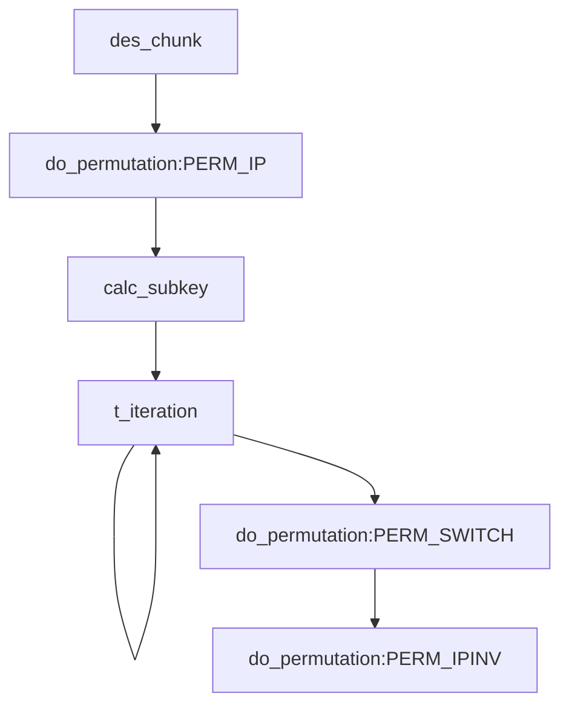
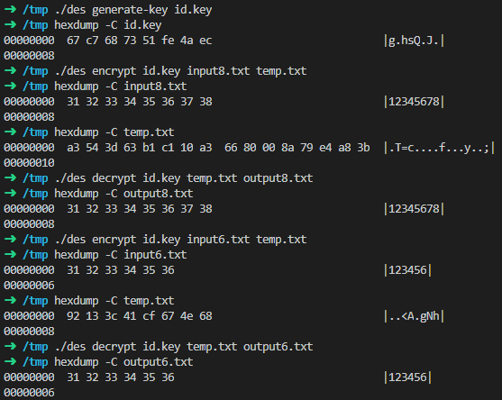

# Information Security

## Assignment 1 - DES 算法实现
### 算法原理概述
DES 是一种典型的块加密方法：它以 64 位为分组长度，64 位一组的明文作为算法的输入，通过一系列复杂的操作，输出同样 64 位长度的密文。 
### 总体结构
本程序的总体实现结构和 DES 算法过程完全一致：


### 模块分解
本程序分为以下三个模块：
#### `binary.c`
该模块中包含二进制数的操作工具函数。本程序实现 DES 加密算法的方式是将计算都囊括在 `uint64_t` 类型下，因为 DES 操作的数字都不超过 64 位，使用位运算执行移位、拼接要比字节数组要方便得多，速度也更快。

#### `permutation.c`
该模块中包含 DES 的置换、变换以及 S-盒变换的工具函数以及变换矩阵。

##### 变换函数

```c
/**
 * @brief 根据变换表 table，将 chunk 进行变换
 * @param perm 变换表，表中每个元素 e 表示对应位置 i 变换为 chunk[e]
 * @param chunk 将被变换的数组
 * @return 变换后的数组
 */
uint64_t do_permutation(const permutation_t *perm, uint64_t chunk)
{
    uint64_t result = 0;
    for (int i = 0; i < perm->to_bits; ++i)
    {
        result = (result << 1) | get_bit(chunk, perm->from_bits - perm->table[i] - 1);
    }
    return result;
}
```

##### S-Box 变换

```c
/**
 * @brief 做 DES 的 S-Box 选择
 * @note S-Box 选择函数是 6 位转 4 位的变换。
 * 假设 Si=(abcdef)2，那么 n=(af)2 确定行号，m=(bcde)2 确定列号
 * @param chunk 二进制位数为 6 的 Feistel 轮函数分组
 * @return 二进制位数为 4 的选择后的分组
 */
uint64_t do_sbox(const int box[4][16], uint64_t chunk)
{
    assert(0 <= chunk && chunk < (1 << 6));
    return box[((chunk >> 4) & 0x2) | (chunk & 0x1)][(chunk >> 1) & 0xF];
}
```

#### `des.c`
该模块中包含 DES 主算法，包括 `Feistel` 函数、`T` 迭代、子密钥计算、密钥生成、以及将输入流进行 DES 加解密的算法。

##### `feistel`

```c
/**
 * @brief Feistel 轮函数
 * @param r 长度为 32 位的串 R[i - 1]
 * @param k 长度为 48 位的子密钥 k[i]
 * @return 32 位输出
 */
static des_value_t feistel(des_value_t r, des_value_t k)
{
    // step1: 将长度为32位的串Ri-1 作E-扩展，成为48位的串E(Ri-1)
    des_value_t er = do_permutation(&PERM_E_EXTENSION, r);
    // step2: 将E(Ri-1) 和长度为48位的子密钥Ki 作48位二进制串按位异或运算，Ki 由密钥K生成
    des_value_t g = er ^ k;
    // step3: 将(2) 得到的结果平均分成8个分组，每个分组长度6位。各个
    // 分组分别经过8个不同的S-盒进行6-4 转换，得到8个长度分别为4位的分组
    // step4: 将(3) 得到的分组结果顺序连接得到长度为32位的串；
    des_value_t s =
        (do_sbox(S1_BOX, (g >> 42) & 0x3F) << 28) |
        (do_sbox(S2_BOX, (g >> 36) & 0x3F) << 24) |
        (do_sbox(S3_BOX, (g >> 30) & 0x3F) << 20) |
        (do_sbox(S4_BOX, (g >> 24) & 0x3F) << 16) |
        (do_sbox(S5_BOX, (g >> 18) & 0x3F) << 12) |
        (do_sbox(S6_BOX, (g >> 12) & 0x3F) <<  8) |
        (do_sbox(S7_BOX, (g >>  6) & 0x3F) <<  4) |
        (do_sbox(S8_BOX, (g >>  0) & 0x3F) <<  0);
    // step5: 将(4)的结果经过P-置换，得到的结果作为轮函数f(Ri-1, Ki) 的最终32位输出
    return do_permutation(&PERM_P, s);
}
```

##### 生成子密钥

```c
/**
 * @brief 生成子密钥
 * @param key 64 位密钥 K
 * @param subkeys 生成的 16 个 48 位子密钥
 */
static void calc_subkey(des_value_t key, des_value_t subkeys[16])
{
    static int SHIFT_BITS[] = {1, 1, 2, 2, 2, 2, 2, 2, 1, 2, 2, 2, 2, 2, 2, 1};

    key = do_permutation(&PERM_REMOVE_PARITY, key);
    key = do_permutation(&PERM_PC1, key);
    des_value_t c = (key >> 28) & 0xFFFFFFF, d = key & 0xFFFFFFF;
    for (int i = 0; i < 16; ++i)
    {
        c = loop_shl(c, 28, SHIFT_BITS[i]);
        d = loop_shl(d, 28, SHIFT_BITS[i]);
        des_value_t cd = (c << 28) | d;
        subkeys[i] = do_permutation(&PERM_PC2, cd);
    }
}
```

##### T 迭代

```c
/**
 * @param m 上一次 T 迭代的结果 M[i-1]=L[i-1]R[i-1]
 * @param k 长度为 48 位的子密钥 k[i]
 * @return L[i]R[i]
 */
static des_value_t t_iteration(des_value_t m, des_value_t k)
{
    des_value_t l = (m >> 32) & 0xFFFFFFFF, r = m & 0xFFFFFFFF;
    return (r << 32) | (l ^ feistel(r, k));
}
```

##### DES 块加密

```c
static des_value_t des_chunk(des_value_t m, des_value_t key, int mode)
{
    // C = E_k(M) = IP^(-1)·W·T_16·...·T_1·IP(M)
    des_value_t subkeys[16];
    m = do_permutation(&PERM_IP, m);
    calc_subkey(key, subkeys);
    for (int i = 0; i < 16; ++i)
        if (mode == DES_ENCRYPT)
            m = t_iteration(m, subkeys[i]);
        else
            m = t_iteration(m, subkeys[15 - i]);
    m = do_permutation(&PERM_SWITCH, m);
    m = do_permutation(&PERM_IPINV, m);
    return m;
}
```

### 数据结构

由于程序的计算全部使用 `uint64_t` 类型参与计算，因此 DES 算法实现中并没有用到任何的数据结构。不过值得一提的是我实现的 `permutation_t`，该结构体包含变换矩阵本身、变换矩阵的行数和列数。我们只需要调用 `do_permutation` 函数并传入变换矩阵就可以将输入的 `uint64_t` 整数进行变换。

### C 语言源代码
本程序源代码为该压缩包的根目录，您可以在 Linux 环境下通过 `make` 命令编译该程序。运行生成的 `bin/des` 程序以查看使用方法。

### 编译运行结果
#### 生成密钥
运行结果如下图所示，可以看到生成的密钥为 `0x67C7687351FE4AEC`，是 64 位的。
经过计算，可以确认该密钥中的校验位都是合法的。
#### 输入：`12345678`
接着运行加密任务，将 `input8.txt` 加密后的数据存储在了 `temp.txt` 中。可以看到因为 `input8.txt` 中的数据恰好为 64 位，因此需要额外补一个块，块内每个字节都是 `0x08`。因此 `temp.txt` 中的数据为 2 块。
最后运行解密任务，解密后可以看到输出文件恰好为 `12345678`。

#### 输入：`123456`
运行加密任务后可以看到由于明文不足 64 位，补齐后加密得到的密文是 64 位的。最后解密完成后恰好为 `123456`，并将补齐的两个 `0x02` 字节删去了。

