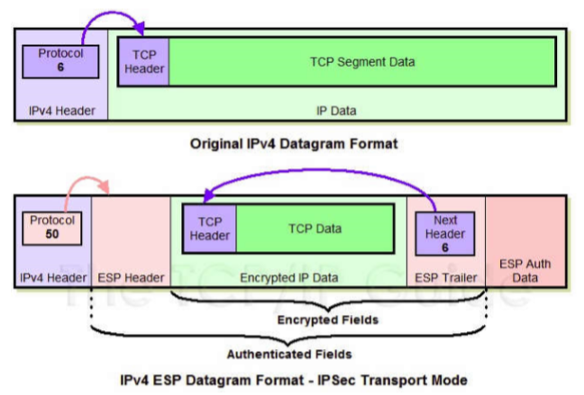

# IPSec 传输模式下 ESP 报文的装包与拆包过程
## IPSec

IPSec 在传输模式下仅保护原始 IP 报文中的载荷。经过 IPSec 网关的 IP 数据包将会被重新打包，IP 数据包头基本被保留，但需设置 IP 扩展协议（next header）头，将新协议载荷添加在后面形成 IPSec 数据包。

因此，ESP 报文的装包和拆包仅针对 IP 报文载荷。

## ESP 报文结构

传输模式下 ESP 报文结构如下

其中，新 IP 头和原 IP 头的区别在于 Protocol，新 IP 头保存 ESP 协议编号 50，旧 IP 头保存的是载荷的协议（比如上图示例中载荷为 TCP 协议数据包，因此协议编号为 6）。

## 装包过程

1. 在原报文末尾添加 ESP Trailer 信息：填充位、填充长度和原载荷报文协议类型

   在上面的例子中，被封装的原报文协议为 TCP，因此类型（Next header）为 6。

2. 将原 IP 报文以及第一步得到的 ESP trailer 作为整体进行加密封装，加密算法和密钥由 SA 给出

   在上面的例子中，指 Encrypted Fields

3. 为第二步得到的加密数据添加 ESP header。ESP header 由 SPI 和 Seq# 两部分组成，与加密数据 Encrypted Fields 一起构成认证部分 Authenticated Fields。原报文无论是协议类型、协议头还是载荷都被 ESP 保护了。

4. 附加完整性校验码到报文末尾，构成 ESP Auth Data。校验码生成算法由 SA 给出。

5. 在报文头部添加新的 IP 头（相对于原 IP 头仅修改 Protocol=50，表示 IP 数据包封装了 ESP 报文）。

## 拆包过程

1. 接收方收到 IP 报文后，发现协议类型为 50，表示这是一个 ESP 包。首先查看 ESP Header，通过 SPI 决定数据报文对应的 SA，获得对应模式为传输模式，以及安全规范（如加密算法、密钥、消息摘要算法）。

2. 计算 Authenticated Fields 的摘要并与 ESP Auth Data 中的 ICV 对比。对数据认证。
3. 检查 Seq# 顺序号，确保数据难以被重放攻击
4. 根据 SA 的加密算法和密钥解密数据，得到明文数据（上例中是 TCP 报文）和 ESP trailer。
5. 根据 ESP trailer 的填充长度信息，找出填充字段的长度，删去后得到原来的报文（上例中是 TCP 报文）