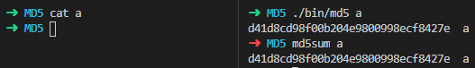
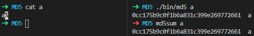
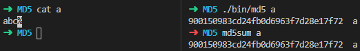
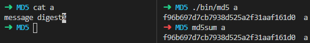
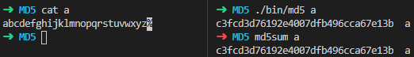
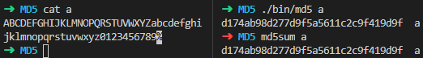
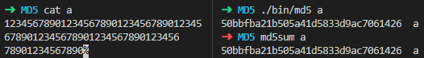

# MD5 算法实现

## 算法原理概述

MD5 是标准的哈希算法。首先对数据进行分块：每 512 位（64 字节）为一个块，并对最后一个块进行填充，并最后再存储数据长度 K（位）。分块完成后对每个 512 位块 $Y_i$ 和上一个块的 128 位计算结果 $CV_{i-1}$ 计算 $H_{MD5}$ 压缩函数的 128 位函数值 $CV_i$。最后的 $CV_l$ 即为该数据的 MD5 哈希值。

$H_{MD5}$ 压缩函数从 $CV_i $ 输入128 位，执行 4 轮操作，每轮选用不同的生成函数 $F,G,H,I$，结合指定的常数表 $T$、消息分组下标表 $X$、循环左移表 $S$，做 16 次迭代运算，生成下一轮的输入。最后产生的输出与 $CV_i $ 的和即为函数解 $CV_{i+1}$。

## 总体结构

程序总体结构和 MD5 算法一致

## 模块分解

### `md5_compress`

该函数负责执行一次迭代运算，输入寄存器值 `ABCD`、轮函数 `g`、消息分组字 `X[k]`、T 表元素 `T[i]`、循环左移位数 `s`，输出新的寄存器值到 `ABCD` 中：

```c
static void md5_compress(uint32_t abcd[4], uint32_t (*g)(uint32_t, uint32_t, uint32_t), uint32_t xk, uint32_t ti, uint32_t s)
{
    uint32_t a = abcd[0], b = abcd[1], c = abcd[2], d = abcd[3];
    abcd[0] = d;
    abcd[1] = b + loop_shl(a + g(b, c, d) + xk + ti, 32, s);
    abcd[2] = b;
    abcd[3] = c;
}
```

### `md5_block`

该函数为 MD5 压缩函数 $H_{MD5}$。输入上一轮的结果 `CV[q]`、以及消息分组 `Y[q]`，输出新的结果 `CV[q+1]`。

从代码来看，执行 4 轮，每轮调用迭代函数 16 次，并传入指定的 `X[k]`、`T[i]` 等参数。

```c
static void md5_block(uint32_t vq[4], const uint8_t y[64])
{
    uint32_t abcd[4] = {vq[0], vq[1], vq[2], vq[3]};
    for (int round = 0; round < 4; ++round)
        for (int i = 0; i < 16; ++i)
            md5_compress(abcd, GEN[round], join_uint32(y + X[round][i] * 4), T[round][i], S[round][i]);
    for (int i = 0; i < 4; ++i)
        vq[i] += abcd[i];
}
```

### `md5_stream`

该系列函数负责处理数据流，初始化初始向量 `IV`，允许提供一定长度的数据，并自动切分成数个 512 位的块，并进行最后的填充。

```c
void md5_stream_begin(struct md5_stream *stream)
{
    stream->vector[0] = 0x67452301;
    stream->vector[1] = 0xEFCDAB89;
    stream->vector[2] = 0x98BADCFE;
    stream->vector[3] = 0x10325476;
    stream->len = 0;
    stream->total_len = 0;
}

void md5_stream_data(struct md5_stream *stream, uint8_t data[], int len)
{
    while (len > 0)
    {
        int delta = 64 - stream->len < len ? 64 - stream->len : len;
        memcpy(stream->data + stream->len, data, delta);
        data += delta;
        len -= delta;
        stream->len += delta;
        stream->total_len += delta;
        if (stream->len >= 64)
        {
            md5_block(stream->vector, stream->data);
            stream->len = 0;
        }
    }
}

void md5_stream_end(struct md5_stream *stream, uint8_t result[16])
{
    int filled = 0;
    if (stream->len >= 56)
    {
        // 此时 512 位块仅剩不多于 64 位的空闲位置，不足以同时存放至少一位的填充位和消息位数，需要新增一块
        while (stream->len < 64)
            stream->data[stream->len++] = PADDING[filled++];
        md5_block(stream->vector, stream->data);
        stream->len = 0;
    }
    while (stream->len < 56)
        stream->data[stream->len++] = PADDING[filled++];
    split_uint64(stream->total_len * 8, stream->data + 56);
    md5_block(stream->vector, stream->data);
    stream->len = 0;

    for (int i = 0; i < 4; ++i)
        split_uint32(stream->vector[i], result + i * 4);
}
```

### `binary.c`

该文件内提供了一些字节数组与整数互转的工具函数：

```c
// 循环左移
uint32_t loop_shl(uint32_t chunk, uint32_t len, uint32_t bits)
{
    return (chunk << bits) | (chunk >> (len - bits));
}

// 该函数能确保是小端制读取数据
uint32_t join_uint32(const uint8_t c[])
{
    uint32_t res = 0;
    for (int i = 0; i < 4; ++i)
        res |= ((uint32_t)c[i] & 0xFF) << (i * 8);
    return res;
}

// 该函数能确保是小端制写入数据
void split_uint32(uint32_t x, uint8_t c[])
{
    for (int i = 0; i < 4; ++i)
        c[i] = (x >> (i * 8)) & 0xFF;
}

// 该函数能确保是小端制写入数据
void split_uint64(uint64_t x, uint8_t c[])
{
    for (int i = 0; i < 8; ++i)
        c[i] = (x >> (i * 8)) & 0xFF;
}
```

## 数据结构

由于程序的计算全部使用 `uint32_t` 类型参与计算，因此 MD5 算法实现中并没有用到任何的数据结构。

我额外使用了一个结构体 `md5_stream` 来存放还未填满一个 512 位块的数据，以及数据位数长度、当前的结果 `CV[i]`。

```c
struct md5_stream
{
    // 缓存的 512 位块，MD5 要求将数据切割为数个 512-bit 分组
    // 如果数据无法填满，则填充，若无足够空位，则填充至下一个块
    uint8_t data[64]; // 512-bits
    int len;
    uint64_t total_len;

    uint32_t vector[4];
};
```

## C 语言源代码

本程序源代码为该压缩包的根目录，您可以在 Linux 环境下通过 `make` 命令编译该程序。运行生成的 `bin/md5` 程序以查看使用方法。

## 遇到的问题

实验过程中惊奇地发现，x86 架构的左移存在未定义行为，对于如下代码：

```c
(uint32_t)a << 32
```

编译后输出结果为 0，但是：

```c
(uint32_t)a << len
```

其中 `len=32` ，编译后输出结果和 `a` 一致，因此与预期行为不符。后来发现 x86 CPU 会对左移位数进行取模：32 位整数的移位不能超过 31，否则将会对 32 取模。因此若 `len=32`，取模后相当于不左移，因此输出结果和 `a` 一致。这个问题在我编写循环左移发生，困扰了好一会。

此外，我最后忘记将数据位数乘 8（我存储的数据位数为字节数而非位数，导致错误），一开始发现算法仅在没有任何数据的情况下的输出才正确，经过考虑，只能是块生成出错，因此问题出在填充的数据位数，才发现了这个问题。

## 实验结果

### （空）



### a



### abc



### message digest



### abcdefghijklmnopqrstuvwxyz



### ABCDEFGHIJKLMNOPQRSTUVWXYZabcdefghijklmnopqrstuvwxyz0123456789



### 较长的输入

```
123456789012345678901234567890123456789012345678901234567890123456
78901234567890
```

