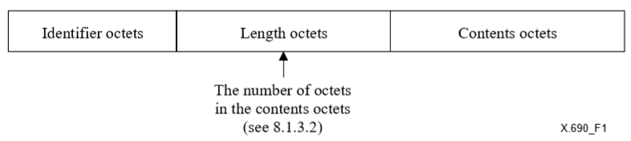
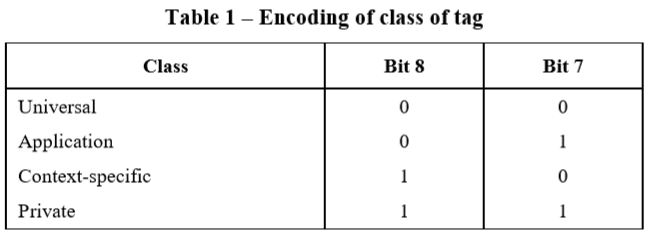
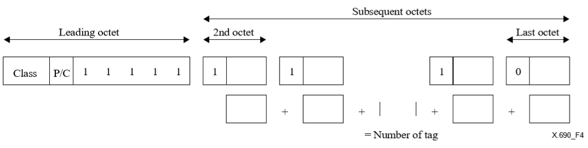
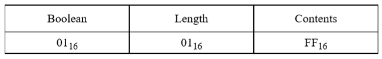
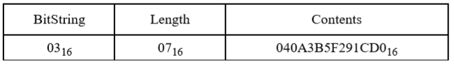
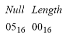
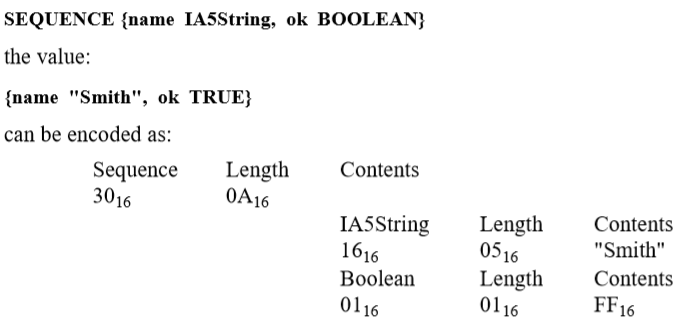
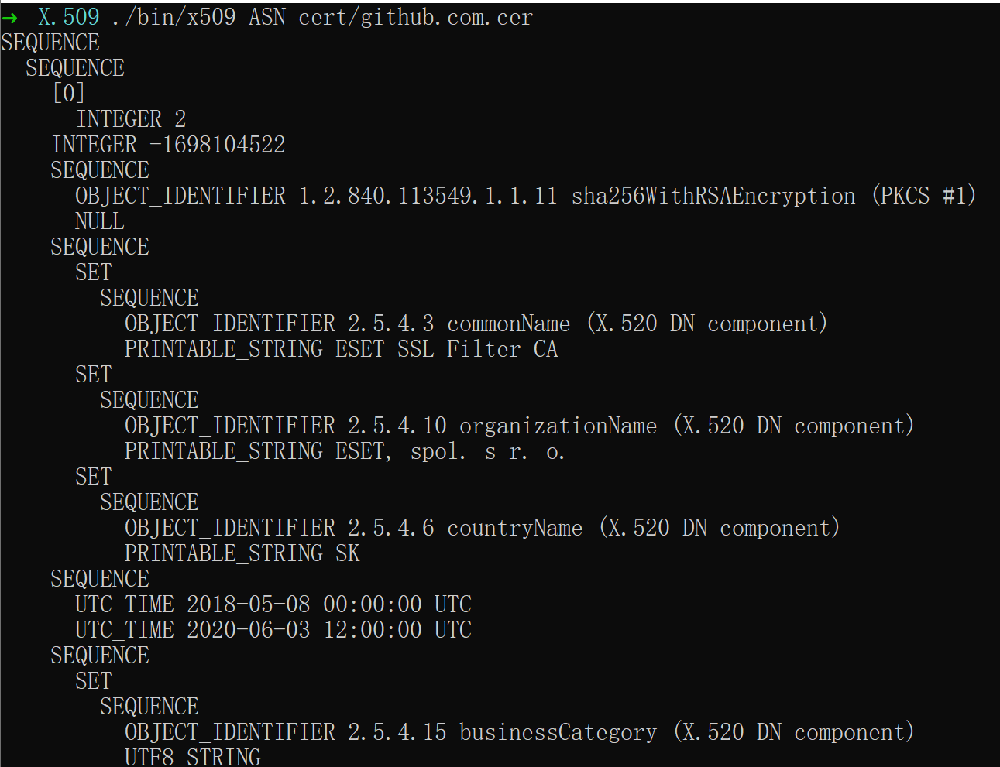
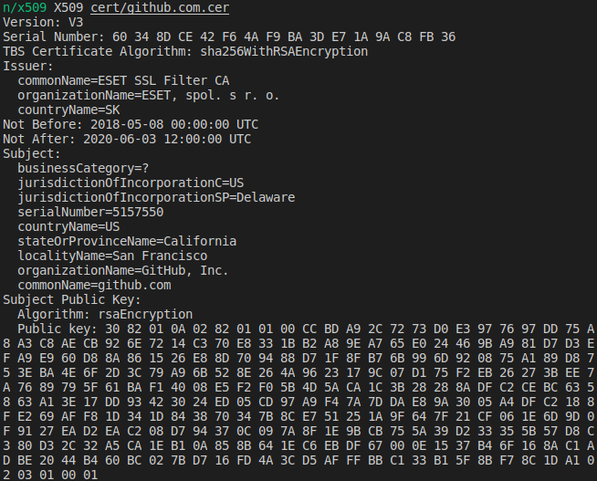

# X.509 数字证书解析

> 17343050 黄昱珲

## X.509 证书结构描述

### ASN.1 标准 (X.690)

ASN.1 标准是一种描述二进制数据结构的数据格式标准。X.509 数字证书标准采用了 ASN.1 标准来描述 X.509 证书格式。X.509 标准采用了 DER 格式来编码 ASN.1 格式的数据。此外，RSA 的公钥也使用了 DER 规范。

DER 格式的 ASN.1 标准除了 RFC 3641 进行了格式规范外，还可以在[微软 MSDN](https://docs.microsoft.com/en-us/windows/win32/seccertenroll/about-der-encoding-of-asn-1-types ) 找到更加易读的 ASN.1 规范和 DER 格式明确定义。

X.690 规定每个数据单元是一个 TLV 结构，TLV 结构包含三项：

1. Identifier Octets：数据单元类型，包含

   1. tag class：数据类型的分类

      

   2. constructed：该数据单元是否由别的数据单元构成

   3. tag number：数据类型

      其中，若数据类型为 0x1F，则表示 Identifier Octets 不止一个字节

      

2. Length Octets

   表示数据的长度，如果数据的长度超过 127，则长度域的第一个字节填充 128+长度域字节数 x，接下来的 x 字节共同表示的大整数为数据的长度（大整数为大端模式）

3. Contents Octets：表示数据单元的数据内容

ASN.1 标准中，通用字符串编码规则（GSER）规定了一些数据格式，每种数据格式的 DER 编码如下：

1. BOOLEAN

   Tag=0x01，表示布尔数据，长度总是为 1，值为 0xFF 时表示真、0x00 时表示假

   

2. INTEGER

   Tag=0x02，表示整数（或大整数）数据，长度不限。

3. BIT_STRING

   Tag=0x03，表示位数据，位数可以不为 8 的位数，由于数据必须以字节为单位，BIT_STRING 的内容中第一个字节表示内容最后一个字节的低位（Least Significant Bit）填充了多少位。因此BIT_STRING 的实际内容字节数总是比 TLV 标记的长度少 1 个字节

   如下图，数据 `0A3B5F291CD` 表示结果如下，由于数据缺 4 位满 8 位，因此在最开始放 `04` 表示最后填充 4 位 0 对齐字节，因此最后存储的结果为 `040A3B5F291CD0`。

   

4. OCTET_STRING

   Tag=0x04，表示字节数组

5. NULL

   Tag=0x05，表示空，对于 ASN.1 中的 OPTIONAL 数据，该项若不存在时用 NULL 填充

   

6. OBJECT_IDENTIFIER

   Tag=0x06，表示对象标识符，通过特定方法存储数据，可通过 OID 表查询对象标识符含义

7. UTF8_STRING

   Tag=0x0C，表示 UTF-8 格式的字符串

8. SEQUENCE

   Tag=0x10，表示序列，必为 constructed，包含多个子结构，用于描述一个结构体。对于 SEQUENCE OF，这个序列表示结构体的数组。

   

9. SET

   Tag=0x11，表示集合，必为 constructed，和 SEQUENCE 的区别在于，SET 内的数据类型应该一致。

10. PRINTABLE_STRING

    Tag=0x13，表示 ASCII 字符串，实际上是字节数组。

11. UTC_TIME

    Tag=0x17，表示格林威治时间，格式为：

    ```
    YYMMDDhhmm(Z|+hhmm|-hhmm)
    ```

    其中：

    1. YY：年份后两位，如 99 表示 1999，03 表示 2003，一般情况下将 70~99 记为 `1970~1999`；00~69 记为 `2000~2069`
    2. MM：月份
    3. DD：日期
    4. hh：小时
    5. mm：分钟
    6. ss：秒
    7. Z：表示格林威治时间
    8. +hhmm：表示离格林威治时间早多少小时多少分钟
    9. -hhmm：表示离格林威治时间晚多少小时多少分钟

    比如 `180508000000Z` 表示 `2018-05-08 00:00:00 UTC`。

### X.509 证书结构

1. 证书（TBSCertificate）
   1. 版本号（Version）：X.509 的版本号，v1(0)、v2(1)、v3(2)
   2. 序列号（SerialNumber）：证书唯一识别符
   3. 签名算法（SignatureAlgorithm）：证书的签名算法
   4. 颁发机构（Issuer）：证书颁发机构的可识别名称
   5. 主体（Subject）：证书申请机构的可识别名称
   6. 证书有效期（Validity）：证书的有效期
      1. 开始时刻（Not Before）
      2. 结束时刻（Not After）
   7. 主体公钥信息（SubjectPublicKeyInfo）
      1. 公钥算法（algorithm）
      2. 公钥（subjectPublicKey）
   8. 颁发机构唯一身份信息：X.509 V2 起可选，用于标识颁发机构
   9. 主体唯一身份信息：X.509 V2 起可选，用于标识主体机构
   10. 扩展：X.509 V3 起可选，包含一些扩展信息
       1. 颁发者别名（issuerAltName）
       2. 主体别名（subjectAltName）
       3. ...
2. 签名算法（SignatureAlgorithm）：签名算法
3. 签名值（SignatureValue）：存放签名值

## 数据结构

### 语法树

我通过递归下降分析法来解析 ASN.1 标准的数据。ASN.1 解析完成后将产生和数据一致的解析树，解析树如下所示：



这个结构通过语法树来存储，语法树是一个多叉树，通过多叉转二叉的方式利用二叉树的数据结构来存储。

```c
typedef struct tiny_ast_s
{
    uint8_t class;
    uint8_t constructed;
    int tag;
    tiny_lex_token_t token;
    int value_type;
    void (*free)(struct tiny_ast_s *);

    struct tiny_ast_s *child;
    struct tiny_ast_s *sibling;
} tiny_ast_t;
```

每个节点保存自己的第一个后代和兄弟节点（也就是典型的多叉树的二叉树表示法）。每个节点标记了保存数据的类型，通过区分类型来查找当前语法树节点是如何保存数据的。

比如保存二进制数据的语法树节点结构如下：

```c
typedef struct tiny_data_ast_s
{
    int padding;
    int length;
    void *value;
    tiny_ast_t ast;
} tiny_data_ast_t;
```

其中包含了原始语法树节点结构体 `ast`。通过利用 `to_struct` 实现可以从 `ast` 恢复出 `data_ast`：

```c
#define to_struct(ptr, type, member) ((type *)((char *)(ptr) - offsetof(type, member)))
```

### 语法分析器

通过构造一系列的文法原语来组装，以便构造一系列的产生式和对应的文法来描述 ASN.1 语法，从而实现建立 ASN.1 描述方法、源代码和 DER 数据格式的联系，源代码效果如下：

```c
DEFINE(
    TBSCertificate,
    ASN_PARSER_MATCH_SEQUENCE(
        /* version */ GRAMMAR(Version),
        /* serialNumber */ GRAMMAR(CertificateSerialNumber),
        /* signature */ ACTION(tbs_signature_action, GRAMMAR(AlgorithmIdentifier), algorithm_identifier_action),
        /* issuer */ ACTION(issuer_action, GRAMMAR(Name), name_action),
        /* validity */ GRAMMAR(Validity),
        /* subject */ ACTION(subject_action, GRAMMAR(Name), name_action),
        /* subjectPublicKeyInfo */ GRAMMAR(SubjectPublicKeyInfo),
        /* issuerUniqueID */ OPTIONAL(
            ASN_PARSER_TLV(
                ASN_TAG_CLASS_CONTEXT,
                1, // [1]
                GRAMMAR(UniqueIdentifier))),
        /* subjectUniqueID */ OPTIONAL(
            ASN_PARSER_TLV(
                ASN_TAG_CLASS_CONTEXT,
                2, // [2]
                GRAMMAR(UniqueIdentifier))),
        /* extensions */ OPTIONAL(
            ASN_PARSER_TLV(
                ASN_TAG_CLASS_CONTEXT,
                3, // [3]
                GRAMMAR(Extensions)))));
```

以上的 C 源程序定义了如下的 ASN 描述的结构体：

```
TBSCertificate  ::=  SEQUENCE  {
     version         [0]  Version DEFAULT v1,
     serialNumber         CertificateSerialNumber,
     signature            AlgorithmIdentifier,
     issuer               Name,
     validity             Validity,
     subject              Name,
     subjectPublicKeyInfo SubjectPublicKeyInfo,
     issuerUniqueID  [1]  IMPLICIT UniqueIdentifier OPTIONAL,
                          -- If present, version MUST be v2 or v3
     subjectUniqueID [2]  IMPLICIT UniqueIdentifier OPTIONAL,
                          -- If present, version MUST be v2 or v3
     extensions      [3]  Extensions OPTIONAL
                          -- If present, version MUST be v3 --  }
```

可见，语法分析器也采用了**多叉树**的方式进行组织。

### 字典树

DER 的 Object Identifier 类型存储的数据在解码后会得到类似 `2.5.4.10` 的数据，存在一个 Object Identifier 的对应关系表，将 Issuer 中的 `2.5.4.10` 翻译为 `organizationName`，也就是证书颁发机构的组织名。

这个对应关系是字符串到 OID 的关系，实现这个关系的数据结构是字典树（Trie），预先准备 OID 的表，或从文件中读入 OID 的对应关系，再加载进字典树中存储。由于这个 OID 表是静态的，因此这个字典树甚至可以并发读取。

### 链表

在读取数据的时候，为了支持流式读取，采用了链表来存储数据，从而方便语法分析器回退。

## 源代码

源代码参见压缩包目录，压缩包目录结构中，`src` 为源文件目录，`include` 为头文件目录，`cert` 为样例证书目录。

### 解析时间

ASN.1 的 `UTCTime` 和 `GeneralizedName` 均通过保存 ASCII 字符串的形式记录时间，因此我们先利用 OctetString 的解析器读取出字符串，再根据格式 `YYMMDDhhmmss` 解析：

```c
static void parse_time(const char *time, bool shortYear, char *out)
{
    int year, month, day, hour, minute = 0, second = 0, microsecond = 0, d, zoneMonth = 0, zoneMinute = 0;
    if (shortYear)
    {
        year = parse_int(time, time + 2);
        if (year < 70) year += 2000;
        else year += 1900;
        time += 2;
    }
    else
    {
        year = parse_int(time, time + 4);
        time += 4;
    }
    month = parse_int(time, time + 2), time += 2;
    day = parse_int(time, time + 2), time += 2;
    hour = parse_int(time, time + 2), time += 2;
    if (*time) minute = parse_int(time, time + 2), time += 2;
    if (*time) second = parse_int(time, time + 2), time += 2;
    if (*time == '.' || *time == ',')
    {
        time++;
        int len;
        for (len = 0; len <= 3 && isdigit(*(time + len)); ++len);
        microsecond = parse_int(time, time + len), time += len;
    }
    if (*time == 'Z') d = 0, time++;
    else if (*time == '+') d = 1, time++;
    else if (*time == '-') d = -1, time++;

    if (*time && *(time + 1))
        zoneMonth = parse_int(time, time + 2), time += 2;
    if (*time && *(time + 1))
        zoneMinute = parse_int(time, time + 2), time += 2;

    out += sprintf(out, "%04d-%02d-%02d %02d:%02d:%02d", year, month, day, hour, minute, second);
    if (microsecond) out += sprintf(out, ".%04d", microsecond);
    if (d == 0) out += sprintf(out, " UTC");
    else out += sprintf(out, " GMT%c%02d:%02d", d > 0 ? '+' : '-', zoneMonth, zoneMinute);
}
```

### 解析 OID

根据格式解析 OID 即可，接着根据解析出的字符串在字典树中查找对应的 OID 项即可

```c
static tiny_parser_result_t parser_asn_oid(tiny_parser_ctx_t ctx, tiny_scanner_t *scanner)
{
    char str[128];
    int bits = 0, n = 0, c = 0;
    tiny_lex_token_t token;
    for (int i = 0; i < ctx.length; ++i)
    {
        token = tiny_scanner_next(scanner);
        if (token.error) return tiny_syntax_make_failure_result(token, 0, token.error);
        n = (n << 7) | (token.byte & 0x7F);
        bits += 7;
        if (!(token.byte & 0x80))
        {
            if (c == 0)
            {
                int m = n < 80 ? n < 40 ? 0 : 1 : 2;
                c += snprintf(str + c, 128 - c, "%d.%d", m, (n - m * 40));
            }
            else
            {
                c += snprintf(str + c, 128 - c, ".%d", n);
            }
            n = 0;
            bits = 0;
        }
    }

    void *oid = trie_search(OID_trie, str);
    if (oid)
    {
        tiny_make_data_ast(ast, ASN_TAG_OBJECT_IDENTIFIER, AST_VALUE_STRUCT);
        ast->value = oid;
        return tiny_syntax_make_success_result(&ast->ast);
    }
    else
    {
        return tiny_syntax_make_failure_result(token, 0, ASN_INVALID_OID);
    }
}
```

### 解析并输出 X.509 证书内容

我们通过在语义分析阶段，利用语义分析的 ACTION，在语法分析的同时进行语义分析。语法分析是在分析 ASN.1 的 DER 格式数据，那么语义分析就是解读 X.509 证书内容。我们通过在定义文法时插入 ACTION 即可实现边解析边输出证书内容：

```c
static int indent = 0;

static void print_indent()
{
    for (int i = 0; i < indent; ++i)
        printf("  ");
}

static void version_action(tiny_ast_t *ast)
{
    print_indent();
    printf("Version: V%d\n", ast2int_ast(ast)->value + 1);
}

static void certificate_serial_number_action(tiny_ast_t *ast)
{
    print_indent();
    printf("Serial Number: ");
    tiny_data_ast_t *data_ast = ast2data_ast(ast);
    uint8_t *bytes = data_ast->value;
    for (int i = 0; i < data_ast->length; ++i)
    {
        if (i > 0) putchar(' ');
        printf("%02X", bytes[i]);
    }
    putchar('\n');
}

static void algorithm_identifier_action(tiny_ast_t *ast)
{
    tiny_data_ast_t *data_ast = ast2data_ast(ast->child);
    const char *(*oid)[3] = data_ast->value;
    printf("%s\n", (*oid)[1]);
}

static void signature_action()
{
    print_indent();
    printf("Certificate Algorithm: ");
}

static void tbs_signature_action()
{
    print_indent();
    printf("TBS Certificate Algorithm: ");
}

static void not_before_action(tiny_ast_t *ast)
{
    print_indent();
    tiny_data_ast_t *data_ast = ast2data_ast(ast);
    char *string = data_ast->value;
    printf("Not Before: %s\n", string);
}

static void not_after_action(tiny_ast_t *ast)
{
    print_indent();
    tiny_data_ast_t *data_ast = ast2data_ast(ast);
    char *string = data_ast->value;
    printf("Not After: %s\n", string);
}

static void issuer_action()
{
    print_indent();
    printf("Issuer: ");
}

static void subject_action()
{
    print_indent();
    printf("Subject: ");
}

static void subject_public_key_preaction()
{
    print_indent();
    printf("Subject Public Key:\n");
    indent++;
    print_indent();
    printf("Algorithm: ");
}

static void subject_public_key_postaction(tiny_ast_t *ast)
{
    indent--;
}

static void public_key_action()
{
    print_indent();
    printf("Public key: ");
}

static void bit_string_action(tiny_ast_t *ast)
{
    tiny_data_ast_t *data_ast = ast2data_ast(ast);
    uint8_t *bytes = data_ast->value;
    if (data_ast->padding == 0)
    {
        for (int i = 0; i < data_ast->length; ++i)
        {
            if (i > 0) putchar(' ');
            printf("%02X", bytes[i]);
        }
    }
    else
    {
        for (int i = 0; i < data_ast->length; ++i)
        {
            int skip = i + 1 == data_ast->length ? data_ast->padding : 0;
            for (int j = 7; j >= skip; --j)
                printf("%d", (bytes[i] >> j) & 1);
        }
    }
    putchar('\n');
}

static void name_action(tiny_ast_t *ast)
{
    putchar('\n');
    for (tiny_ast_t *rdn = ast->child; rdn; rdn = rdn->sibling)
    {
        for (tiny_ast_t *attr = rdn->child; attr; attr = attr->sibling)
        {
            tiny_data_ast_t *oid_ast = ast2data_ast(attr->child);
            tiny_data_ast_t *str_ast = ast2data_ast(attr->child->sibling);
            OID_entry_t *oid = oid_ast->value;
            const char *value = str_ast->value;
            print_indent();
            if (attr->child->sibling->value_type == AST_VALUE_STRING)
                printf("  %s=%s\n", (*oid)[1], value);
            else
                printf("  %s=?\n", (*oid)[1]);
        }
    }
}

static void reduce_indent()
{
    indent -= 2;
}

struct trie *prepare_parsers()
{
    struct trie *parsers = trie_create();

    DEFINE(
        Certificate,
        ASN_PARSER_MATCH_SEQUENCE(
            GRAMMAR(TBSCertificate),
            ACTION(signature_action, GRAMMAR(AlgorithmIdentifier), algorithm_identifier_action),
            ASN_PARSER_BIT_STRING));

    DEFINE(
        TBSCertificate,
        ASN_PARSER_MATCH_SEQUENCE(
            GRAMMAR(Version),
            GRAMMAR(CertificateSerialNumber),
            ACTION(tbs_signature_action, GRAMMAR(AlgorithmIdentifier), algorithm_identifier_action),
            ACTION(issuer_action, GRAMMAR(Name), name_action),
            GRAMMAR(Validity),
            ACTION(subject_action, GRAMMAR(Name), name_action),
            GRAMMAR(SubjectPublicKeyInfo),
            OPTIONAL( // issuerUniqueID
                ASN_PARSER_TLV(
                    ASN_TAG_CLASS_CONTEXT,
                    1,
                    GRAMMAR(UniqueIdentifier))),
            OPTIONAL( // subjectUniqueID
                ASN_PARSER_TLV(
                    ASN_TAG_CLASS_CONTEXT,
                    2,
                    GRAMMAR(UniqueIdentifier))),
            OPTIONAL(
                ASN_PARSER_TLV(
                    ASN_TAG_CLASS_CONTEXT,
                    3,
                    GRAMMAR(Extensions)))));

    DEFINE(
        Version,
        POST_ACTION(
            ASN_PARSER_TLV(
                ASN_TAG_CLASS_CONTEXT,
                0, // [0]
                ASN_PARSER_INTEGER),
            version_action));

    DEFINE(
        CertificateSerialNumber,
        POST_ACTION(
            ASN_PARSER_BIG_INTEGER,
            certificate_serial_number_action));

    DEFINE(
        AlgorithmIdentifier,
        ASN_PARSER_MATCH_SEQUENCE(
            ASN_PARSER_OBJECT_IDENTIFIER,           // algorithm
            OR(GRAMMAR(DssParams), ASN_PARSER_NULL) // parameters
        ));

    DEFINE(
        DssParams,
        ASN_PARSER_MATCH_SEQUENCE(
            ASN_PARSER_INTEGER, // r
            ASN_PARSER_INTEGER  // s
            ));

    DEFINE(
        Name,
        GRAMMAR(RDNSequence));

    DEFINE(
        RDNSequence,
        ASN_PARSER_SEQUENCE_OF(GRAMMAR(RelativeDistinguishedName)));

    DEFINE(
        RelativeDistinguishedName,
        ASN_PARSER_SET_OF(GRAMMAR(AttributeTypeAndValue)));

    DEFINE(
        AttributeTypeAndValue,
        ASN_PARSER_MATCH_SEQUENCE(
            GRAMMAR(AttributeType), // type
            GRAMMAR(AttributeValue) // value
            ));

    DEFINE(
        AttributeType,
        ASN_PARSER_OBJECT_IDENTIFIER);

    DEFINE(
        AttributeValue,
        ASN_PARSER_ANY);

    DEFINE(
        Validity,
        ASN_PARSER_MATCH_SEQUENCE(
            POST_ACTION(GRAMMAR(Time), not_before_action),
            POST_ACTION(GRAMMAR(Time), not_after_action)));

    DEFINE(
        Time,
        OR(
            ASN_PARSER_UTC_TIME,
            ASN_PARSER_GENERALIZED_TIME));

    DEFINE(
        UniqueIdentifier,
        ASN_PARSER_BIT_STRING);

    DEFINE(
        SubjectPublicKeyInfo,
        ACTION(
            subject_public_key_preaction,
            ASN_PARSER_MATCH_SEQUENCE(
                POST_ACTION(GRAMMAR(AlgorithmIdentifier), algorithm_identifier_action), // algorithm
                ACTION(                                                                 // subjectPublicKey
                    public_key_action,
                    ASN_PARSER_BIT_STRING,
                    bit_string_action)),
            subject_public_key_postaction));

    DEFINE(
        RSAPublicKey,
        ASN_PARSER_MATCH_SEQUENCE(
            ASN_PARSER_INTEGER, // modulus
            ASN_PARSER_INTEGER  // publicExponent
            ));
    
    DEFINE(
        Extensions,
        ASN_PARSER_SEQUENCE_OF(GRAMMAR(Extension))
    );
    
    DEFINE(
        Extension,
        ASN_PARSER_MATCH_SEQUENCE(
            ASN_PARSER_OBJECT_IDENTIFIER,
            OPTIONAL(ASN_PARSER_BOOLEAN),
            ASN_PARSER_OCTET_STRING
        )
    );

    return parsers;
}

```

## 运行输出

通过在 Linux 系统下运行 `make` 命令可产生可执行文件 `bin/x509`，通过执行 `./bin/x509 X509 cert/github.com.cer` 可查看 GitHub X.509 证书内容如下：

